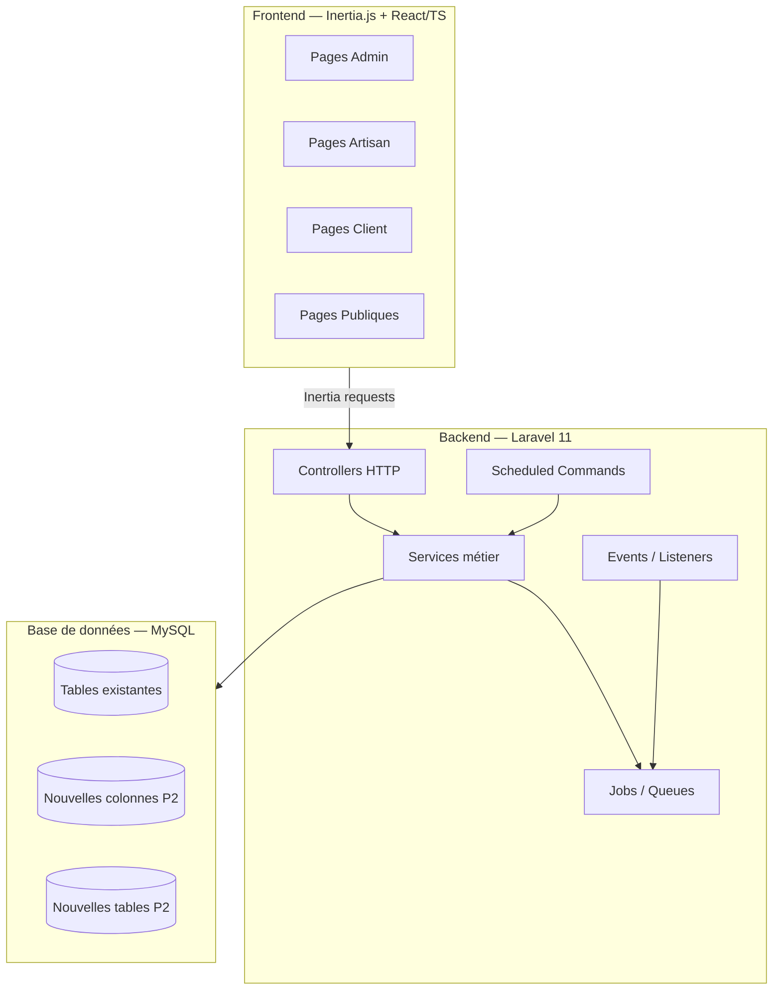

# Document de Conception — ArtisanPro Features P2

> **Stack** : Laravel 11 · PHP 8.2 · Inertia.js · React · TypeScript · Tailwind CSS · MySQL
> **Workflow** : Design-First — High-Level Design + Low-Level Design

---

## Table des matières

1. [Vue d'ensemble globale](#1-vue-densemble-globale)
2. [F1 — Scoring de confiance automatique](#2-f1--scoring-de-confiance-automatique)
3. [F2 — Modération des avis (admin)](#3-f2--modération-des-avis-admin)
4. [F3 — Gestion admin des litiges](#4-f3--gestion-admin-des-litiges)
5. [F4 — Notifications système (table alimentée)](#5-f4--notifications-système-table-alimentée)
6. [F5 — Académie / Formation (pages artisan)](#6-f5--académie--formation-pages-artisan)
7. [F6 — Géolocalisation temps réel (historique)](#7-f6--géolocalisation-temps-réel-historique)
8. [F7 — Partenaires (pages basiques)](#8-f7--partenaires-pages-basiques)
9. [Dépendances transversales](#9-dépendances-transversales)

---

## 1. Vue d'ensemble globale

ArtisanPro est un monolithe Laravel avec rendu côté serveur via Inertia.js.
Les 7 fonctionnalités P2 s'intègrent dans l'architecture existante sans rupture :
chaque feature ajoute des migrations, des services/jobs Laravel, des contrôleurs
et des pages React/TypeScript dans les espaces portail existants (admin, artisan, client).

### Architecture globale

---

## 2. F1 — Scoring de confiance automatique

### 2.1 Vue d'ensemble

Le `ScoringService` existe déjà et calcule un score sur 100 points.
