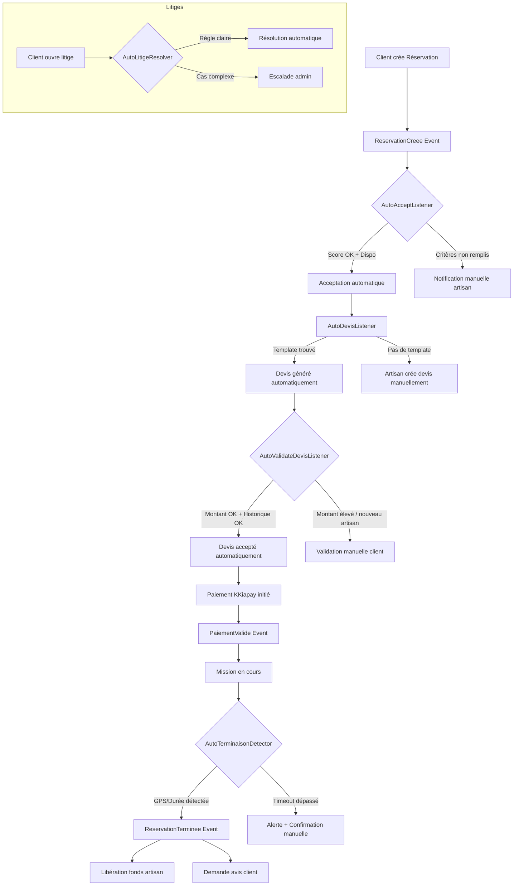
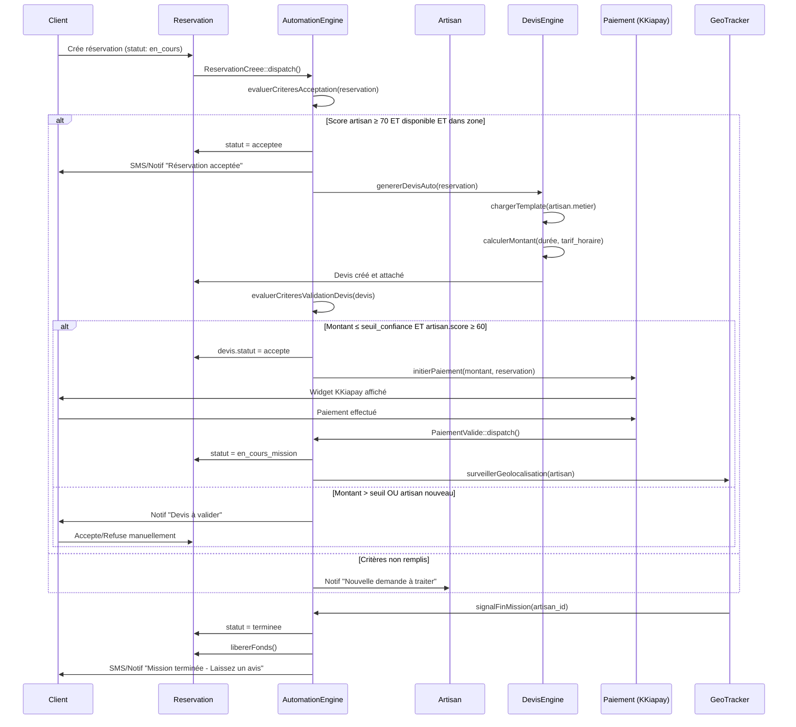
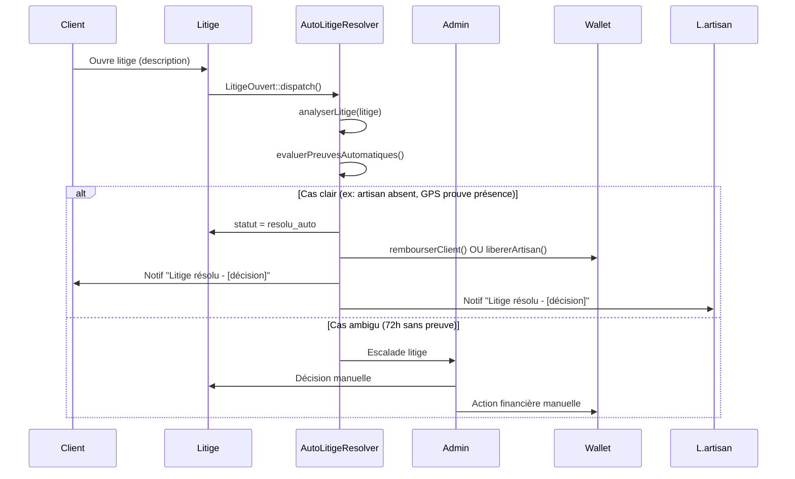
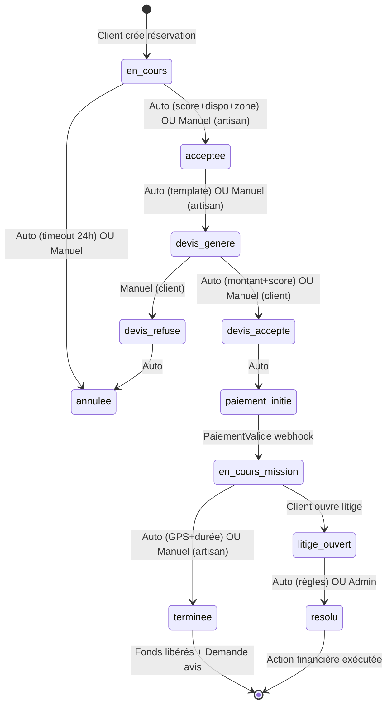
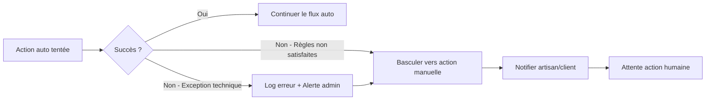

# Document de Design — Automatisation des Interactions Artisan-Client (ArtisanPro)

## Vue d'ensemble

Ce document décrit l'architecture et les composants nécessaires pour automatiser l'ensemble du cycle de vie d'une réservation sur ArtisanPro, depuis la création par le client jusqu'à la confirmation de fin de mission, en passant par l'acceptation, la génération de devis, la validation et la gestion des litiges.

L'automatisation repose sur un moteur de règles configurable (`AutomationEngine`), des Listeners Laravel attachés aux Events existants, et des Jobs planifiés pour les actions différées. Les interactions manuelles deviennent optionnelles : chaque étape peut soit s'exécuter automatiquement selon des règles métier, soit basculer vers une intervention humaine en cas d'ambiguïté ou d'exception.

---

## Architecture Globale



---

## Flux de Réservation Automatisé (Séquences)

### Flux principal : Réservation → Paiement → Fin



### Flux de résolution de litige



---

## Composants et Interfaces

### 1. AutomationEngine (Service Central)

**Rôle** : Coordinateur de toutes les décisions d'automatisation. Évalue les règles, déclenche les actions, et route vers les interventions manuelles si nécessaire.

```php
interface AutomationEngineInterface
{
    // Évalue si une réservation peut être acceptée automatiquement
    public function evaluerAcceptationAuto(Reservation $reservation): AutoDecision;

    // Génère un devis automatique basé sur les templates et tarifs
    public function genererDevisAuto(Reservation $reservation): ?Devis;

    // Évalue si un devis peut être validé automatiquement
    public function evaluerValidationDevisAuto(Devis $devis): AutoDecision;

    // Détecte la fin de mission via GPS ou durée
    public function detecterFinMission(Reservation $reservation): bool;

    // Résout un litige automatiquement si les règles le permettent
    public function resoudreLitigeAuto(Litige $litige): AutoDecision;
}
```

**Responsabilités** :
- Charger et évaluer les règles d'automatisation depuis `automation_rules`
- Maintenir un log d'audit de toutes les décisions automatiques
- Déclencher les Events appropriés après chaque décision
- Gérer le fallback vers l'action manuelle

---

### 2. AutoDecision (Value Object)

```php
class AutoDecision
{
    public readonly bool $approuvee;
    public readonly string $raison;
    public readonly float $score_confiance;
    public readonly bool $necessite_intervention_humaine;
    public readonly array $regles_evaluees; // audit trail
}
```

---

### 3. ReservationAutoAcceptListener

**Rôle** : Écouté sur `ReservationCreee`. Décide si la réservation peut être acceptée automatiquement.

**Critères d'acceptation automatique** :
- `artisan.score_confiance >= seuil_score` (configurable, défaut : 70)
- L'artisan est disponible sur le créneau demandé (vérifié via le planning)
- Distance client ↔ artisan ≤ `zone_intervention` (Haversine)
- Pas de réservation conflictuelle dans les paiements en cours

```php
interface ReservationAutoAcceptListenerInterface
{
    public function handle(ReservationCreee $event): void;
    
    // Vérifie la disponibilité dans le planning
    private function verifierDisponibilite(Reservation $reservation): bool;
    
    // Calcule distance Haversine client ↔ artisan
    private function verifierZoneGeographique(Reservation $reservation): bool;
    
    // Vérifie le score de confiance minimum
    private function verifierScoreMinimum(Artisan $artisan): bool;
}
```

---

### 4. DevisAutoGeneratorService

**Rôle** : Génère un devis automatiquement à partir de templates configurables par métier.

**Logique de calcul** :
- Récupère le template actif pour `artisan.metier`
- Applique `tarif_horaire` × `durée_estimée`
- Ajoute le coût des matériaux si template le prévoit
- Soumet optionnellement à l'estimation IA (GPT-4o via `DiagnosticIAController` existant)

```php
interface DevisAutoGeneratorInterface
{
    // Génère un devis depuis un template métier
    public function genererDepuisTemplate(Reservation $reservation): Devis;

    // Affine le montant via estimation IA (optionnel)
    public function affinerAvecIA(Devis $devis, string $descriptionBesoin): Devis;

    // Récupère le template actif pour un métier
    public function getTemplatePourMetier(string $metier): ?DevisTemplate;
}
```

---

### 5. DevisAutoValidatorListener

**Rôle** : Écoute `DevisGenere`. Valide automatiquement le devis si les critères de confiance sont remplis.

**Critères de validation automatique** :
- Montant ≤ `seuil_validation_auto` (configurable par catégorie de métier)
- `artisan.score_confiance >= 60`
- Le client a un historique de paiement sans litige (ratio litiges < 10%)
- Aucun flag de fraude détecté

```php
interface DevisAutoValidatorInterface
{
    public function handle(DevisGenere $event): void;
    
    // Vérifie que le montant est dans le seuil de confiance
    private function verifierSeuilMontant(Devis $devis): bool;
    
    // Analyse l'historique du client pour détecter les risques
    private function evaluerHistoriqueClient(Client $client): float; // ratio confiance 0-1
}
```

---

### 6. MissionTerminaisonDetector (Job planifié)

**Rôle** : Détecte automatiquement la fin d'une mission par deux mécanismes complémentaires.

**Mécanisme 1 — Géolocalisation** :
- Surveille la position GPS de l'artisan (via `HistoriqueGeolocalisation`)
- Si l'artisan s'éloigne de l'adresse d'intervention de > 500m pendant > 10 minutes → fin de mission détectée

**Mécanisme 2 — Durée** :
- Si `date_debut + durée_estimée + buffer_30min` est dépassé → alerte
- Après 2h de dépassement sans confirmation → confirmation automatique forcée

```php
interface MissionTerminaisonDetectorInterface
{
    // Vérifie si la mission est terminée via GPS
    public function detecterViaGPS(Reservation $reservation): bool;
    
    // Vérifie si la durée max est dépassée
    public function detecterViaDuree(Reservation $reservation): bool;
    
    // Confirme la fin et déclenche ReservationTerminee
    public function confirmerFinMission(Reservation $reservation, string $source): void;
}
```

---

### 7. LitigeAutoResolverService

**Rôle** : Tente une résolution automatique des litiges selon des règles métier prédéfinies.

**Règles de résolution automatique** :

| Condition | Décision auto |
|-----------|--------------|
| GPS artisan absent pendant toute la mission | Remboursement client |
| Mission GPS confirmée + client conteste sans preuve | Paiement artisan libéré |
| Litige ouvert > 72h sans réponse artisan | Remboursement client automatique |
| Montant litige < seuil_micro_litige (configurable) | Remboursement client sans escalade |
| Artisan répond avec preuve (photo/GPS) | Escalade admin pour décision |

```php
interface LitigeAutoResolverInterface
{
    // Évalue les preuves GPS disponibles
    public function evaluerPreuvesGPS(Litige $litige): float; // score_preuve 0-1

    // Applique les règles métier et retourne la décision
    public function appliquerRegles(Litige $litige): AutoDecision;

    // Exécute la décision financière (remboursement ou libération)
    public function executerDecisionFinanciere(Litige $litige, AutoDecision $decision): void;
}
```

---

### 8. AutomationConfigService

**Rôle** : Gère les règles d'automatisation configurables par l'admin, stockées en base de données.

```php
interface AutomationConfigInterface
{
    // Récupère une règle par clé (avec cache)
    public function getRegle(string $cle, mixed $defaut = null): mixed;

    // Met à jour une règle (invalide le cache)
    public function setRegle(string $cle, mixed $valeur): void;

    // Retourne toutes les règles actives
    public function getRèglesActives(): Collection;
}
```

**Règles configurables** :
- `auto_accept_score_minimum` (défaut: 70)
- `auto_accept_zone_km_maximum` (défaut: 20)
- `auto_devis_enabled` (défaut: true)
- `auto_validate_devis_montant_max` (défaut: 50 000 FCFA)
- `auto_validate_devis_score_minimum` (défaut: 60)
- `auto_mission_timeout_heures` (défaut: 2)
- `auto_litige_seuil_micro` (défaut: 5 000 FCFA)
- `auto_litige_timeout_artisan_heures` (défaut: 72)

---

## Modèles de Données

### Table : `automation_rules`

```sql
automation_rules
├── id               BIGINT UNSIGNED AUTO_INCREMENT
├── cle              VARCHAR(100) UNIQUE NOT NULL
├── valeur           JSON NOT NULL
├── description      TEXT
├── categorie        VARCHAR(50)  -- 'reservation', 'devis', 'mission', 'litige'
├── actif            BOOLEAN DEFAULT TRUE
├── modifie_par      BIGINT UNSIGNED FK users.id
├── created_at       TIMESTAMP
└── updated_at       TIMESTAMP
```

### Table : `automation_logs`

```sql
automation_logs
├── id               BIGINT UNSIGNED AUTO_INCREMENT
├── type_action      VARCHAR(100)  -- 'auto_accept', 'auto_devis', 'auto_validate', etc.
├── model_type       VARCHAR(100)  -- 'Reservation', 'Devis', 'Litige'
├── model_id         BIGINT UNSIGNED
├── decision         ENUM('approuvee', 'rejetee', 'escaladee')
├── score_confiance  DECIMAL(5,2)
├── regles_evaluees  JSON  -- détail de chaque règle : {cle, valeur_attendue, valeur_reelle, resultat}
├── raison           TEXT
├── duree_ms         INTEGER  -- temps d'évaluation en millisecondes
├── created_at       TIMESTAMP
└── updated_at       TIMESTAMP
```

### Table : `devis_templates`

```sql
devis_templates
├── id                  BIGINT UNSIGNED AUTO_INCREMENT
├── metier              VARCHAR(100) NOT NULL
├── categorie_id        BIGINT UNSIGNED FK categories.id NULLABLE
├── description_type    TEXT  -- description standard des travaux
├── tarif_base          DECIMAL(10,2)  -- montant fixe de base
├── tarif_horaire       DECIMAL(10,2)  -- tarif/heure pour les dépassements
├── duree_estimee_min   INTEGER  -- durée minimale en minutes
├── materiaux_inclus    BOOLEAN DEFAULT FALSE
├── majoration_urgence  DECIMAL(5,2) DEFAULT 1.0  -- multiplicateur pour urgences
├── actif               BOOLEAN DEFAULT TRUE
├── created_at          TIMESTAMP
└── updated_at          TIMESTAMP
```

### Champs ajoutés à `reservations`

```sql
-- Migration additive sur reservations
adresse_intervention   VARCHAR(500) NULLABLE
latitude_client        DECIMAL(10,8) NULLABLE
longitude_client       DECIMAL(11,8) NULLABLE
duree_estimee_min      INTEGER NULLABLE
source_acceptation     ENUM('auto', 'manuel') DEFAULT 'manuel'
source_devis           ENUM('auto', 'ia', 'manuel') DEFAULT 'manuel'
source_validation      ENUM('auto', 'manuel') DEFAULT 'manuel'
source_terminaison     ENUM('auto_gps', 'auto_timeout', 'manuel') NULLABLE
```

### Champs ajoutés à `litiges`

```sql
-- Migration additive sur litiges
source_resolution      ENUM('auto', 'admin') DEFAULT 'admin'
score_preuve_gps       DECIMAL(5,2) NULLABLE  -- 0-100
decision_auto          JSON NULLABLE  -- détail AutoDecision sérialisé
```

---

## Nouveaux Events

```php
// Déclenchés par le moteur d'automatisation

class ReservationAutoAcceptee extends Event
{
    public function __construct(
        public readonly Reservation $reservation,
        public readonly AutoDecision $decision
    ) {}
}

class DevisGenere extends Event
{
    public function __construct(
        public readonly Devis $devis,
        public readonly Reservation $reservation,
        public readonly string $source  // 'auto_template' | 'auto_ia'
    ) {}
}

class DevisAutoValide extends Event
{
    public function __construct(
        public readonly Devis $devis,
        public readonly AutoDecision $decision
    ) {}
}

class MissionTermineeAuto extends Event
{
    public function __construct(
        public readonly Reservation $reservation,
        public readonly string $source  // 'gps' | 'timeout'
    ) {}
}

class LitigeResoluAuto extends Event
{
    public function __construct(
        public readonly Litige $litige,
        public readonly AutoDecision $decision
    ) {}
}
```

---

## Workflows Automatiques (Vue d'ensemble)



---

## Gestion des Erreurs et Fallbacks

### Principe de dégradation gracieuse

Chaque étape automatique est entourée d'un bloc `try/catch`. En cas d'échec de l'automatisation, le système bascule vers l'action manuelle correspondante et notifie les parties concernées.



### Timeouts et sécurités

| Étape | Timeout avant fallback manuel | Action de fallback |
|-------|------------------------------|--------------------|
| Acceptation auto | 30 minutes (si artisan non notifié) | Notification forcée à l'artisan |
| Génération devis auto | 5 minutes | Artisan invité à créer devis manuellement |
| Validation devis auto | Immédiat (si critères non remplis) | Notification client pour validation |
| Détection fin mission | 2 heures après durée estimée | Confirmation forcée + alerte admin |
| Résolution litige auto | 72 heures sans réponse artisan | Escalade admin automatique |

---

## Stratégie de Test

### Tests Unitaires

- `AutomationEngineTest` : Vérification des règles d'évaluation (score, zone, montant)
- `DevisAutoGeneratorTest` : Calcul de montant depuis template
- `LitigeAutoResolverTest` : Application des règles métier sur cas types
- `AutoDecisionTest` : Immutabilité et sérialization du value object

### Tests de Propriété (Property-Based Testing)

**Librairie** : PestPHP avec `pest-plugin-faker`

- Pour tout `score_confiance ∈ [0, 100]`, `evaluerAcceptationAuto` retourne une décision cohérente (approuvée si ≥ seuil, rejetée sinon)
- Pour tout `montant ≥ 0`, la validation auto de devis respecte strictement le seuil configuré
- Pour toute séquence d'états de réservation, les transitions respectent la machine à états définie

### Tests d'Intégration (Feature)

- `AutoWorkflowTest` : Scénario complet réservation → paiement → fin de mission
- `AutoLitigeWorkflowTest` : Scénario litige auto-résolu vs escaladé
- `AutoFallbackTest` : Vérification que chaque étape bascule correctement vers le manuel

---

## Sécurité et Confidentialité

### Protection contre les abus d'automatisation

- **Rate limiting** : Maximum 3 tentatives d'acceptation auto par artisan par heure
- **Audit complet** : Toutes les décisions automatiques sont loguées dans `automation_logs` avec les règles évaluées
- **Override admin** : L'admin peut désactiver l'automatisation globalement ou par artisan via `AutomationConfigService`
- **Seuils de sécurité** : Aucune action financière automatique au-delà de `auto_validate_devis_montant_max`

### Intégrité des données GPS

- Les données GPS ne sont acceptées que depuis les devices des artisans authentifiés
- Validation de plausibilité : déplacement max 200 km/h entre deux points
- Fenêtre de détection fin de mission : minimum 5 minutes consécutives hors zone

---

## Dépendances

| Composant | Technologie | Usage |
|-----------|------------|-------|
| Event/Listener | Laravel Events | Déclenchement des workflows |
| Jobs planifiés | Laravel Scheduler + Queue | `MissionTerminaisonDetector`, timeouts |
| Cache règles | Laravel Cache (Redis) | `AutomationConfigService` |
| GPS | `HistoriqueGeolocalisation` (existant) | Détection fin mission |
| Paiement | KKiapay webhook (existant) | Déclenchement après paiement |
| Notifications | `SmsNotificationService` + `NotificationService` (existants) | Alertes automatiques |
| IA (optionnel) | GPT-4o via `DiagnosticIAController` (existant) | Affinement devis |
| Base de données | MySQL via Eloquent | Persistance règles, logs, templates |


---

## Correctness Properties

*A property is a characteristic or behavior that should hold true across all valid executions of a system — essentially, a formal statement about what the system should do. Properties serve as the bridge between human-readable specifications and machine-verifiable correctness guarantees.*

### Property 1 : AutomationConfig — Round-trip de persistance

*Pour toute* paire (clé, valeur) d'une règle d'automatisation ou d'un template de devis, stocker puis lire immédiatement la valeur doit retourner une valeur équivalente à celle stockée.

**Validates: Requirements 1.1, 1.2, 3.7**

---

### Property 2 : Complétude des logs d'automatisation

*Pour toute* décision émise par l'AutomationEngine (quelle que soit l'action : `auto_accept`, `auto_devis`, `auto_validate`, `auto_mission`, `auto_litige`, `rate_limit_exceeded`), l'entrée créée dans `automation_logs` doit contenir des valeurs non nulles pour chaque champ requis : `type_action`, `model_type`, `model_id`, `decision`, `score_confiance`, `regles_evaluees`, `raison`, `duree_ms`.

**Validates: Requirements 1.5**

---

### Property 3 : Exclusion des artisans désactivés

*Pour tout* artisan dont l'automatisation est désactivée dans `automation_rules`, toute évaluation automatique le concernant doit produire un AutoDecision avec `approuvee = false` et `necessite_intervention_humaine = true`, indépendamment du Score_Confiance ou de tout autre critère.

**Validates: Requirements 1.6, 10.5**

---

### Property 4 : Cohérence de la décision d'acceptation automatique

*Pour tout* triplet (Score_Confiance, distance_haversine, disponibilite) évalué par le ReservationAutoAcceptListener, la décision est `approuvee` si et seulement si Score_Confiance ≥ `auto_accept_score_minimum` ET distance_haversine ≤ `auto_accept_zone_km_maximum` ET disponibilite = true. Dans tous les autres cas, la décision est `rejetee`.

**Validates: Requirements 2.2, 2.3**

---

### Property 5 : Invariant d'absence de conflit de réservation

*Pour tout* artisan ayant une réservation en statut `en_cours` ou `en_cours_mission` sur un créneau donné, une tentative d'acceptation automatique d'une nouvelle réservation chevauchant ce créneau doit produire une décision `rejetee`, quelle que soit la valeur du Score_Confiance ou de la distance.

**Validates: Requirements 2.4**

---

### Property 6 : Invariant de rate limiting

*Pour tout* artisan ayant déjà subi 3 évaluations d'acceptation automatique dans la même fenêtre glissante d'une heure, toute évaluation supplémentaire dans cette fenêtre doit être rejetée avec `type_action = 'rate_limit_exceeded'` dans `automation_logs`, indépendamment des critères de la réservation.

**Validates: Requirements 2.6, 10.6**

---

### Property 7 : Exactitude du calcul de montant de devis

*Pour tout* tuple (tarif_base, tarif_horaire, duree_estimee_min, majoration_urgence) issu d'un template actif, le montant calculé par le DevisAutoGeneratorService doit être exactement égal à `tarif_base + (tarif_horaire × duree_estimee_min / 60) × majoration_urgence`.

**Validates: Requirements 3.2**

---

### Property 8 : Invariant de source du devis généré automatiquement

*Pour tout* devis généré depuis un template par le DevisAutoGeneratorService, la réservation associée doit avoir `source_devis = 'auto'` (ou `source_devis = 'auto_ia'` si le service IA est activé), et l'événement `DevisGenere` doit avoir été dispatché avec la source correspondante.

**Validates: Requirements 3.4, 3.5**

---

### Property 9 : Cohérence de la décision de validation automatique de devis

*Pour tout* quadruplet (montant_devis, score_confiance_artisan, ratio_litiges_client, flag_fraude) évalué par le DevisAutoValidatorListener, la décision est `approuvee` si et seulement si montant_devis ≤ `auto_validate_devis_montant_max` ET score_confiance_artisan ≥ `auto_validate_devis_score_minimum` ET ratio_litiges_client < 0.10 ET flag_fraude = false. Dans tous les autres cas, la décision est `rejetee`.

**Validates: Requirements 4.2, 4.3**

---

### Property 10 : Exactitude du calcul du ratio de litiges client

*Pour tout* client avec un historique de N réservations terminées et L litiges perdus (L ≤ N), le ratio calculé par le DevisAutoValidatorListener doit être exactement L / N. Pour un client sans réservation terminée (N = 0), le ratio doit être 0.

**Validates: Requirements 4.4**

---

### Property 11 : Détection GPS de départ de zone

*Pour toute* séquence de positions GPS d'un artisan relative à une adresse d'intervention, si toutes les positions consécutives sur une fenêtre de 10 minutes ou plus sont à une distance supérieure à 500 mètres de l'adresse d'intervention, alors `detecterViaGPS` doit retourner `true`. Si au moins une position dans la fenêtre est dans le rayon de 500 mètres, le résultat doit être `false`.

**Validates: Requirements 5.2**

---

### Property 12 : Détection du dépassement de durée estimée

*Pour tout* couple (timestamp_actuel, timestamp_debut_mission, duree_estimee_min) tel que timestamp_actuel > timestamp_debut_mission + duree_estimee_min × 60 + 1800 secondes (buffer 30 min), `detecterViaDuree` doit retourner `true`. Dans le cas contraire, il doit retourner `false`.

**Validates: Requirements 5.3, 5.4**

---

### Property 13 : Filtre de plausibilité GPS

*Pour toute* paire de points GPS (P1, P2) avec timestamps T1 < T2, si la vitesse implicite calculée par la formule Haversine(P1, P2) / (T2 - T1) est supérieure à 200 km/h, le point P2 doit être rejeté et journalisé comme anomalie, et le dernier point GPS valide connu doit être retenu.

**Validates: Requirements 5.6, 10.3**

---

### Property 14 : Règles de résolution automatique des litiges

*Pour tout* litige, la décision du LitigeAutoResolverService doit respecter les règles suivantes :
- Si `score_preuve_gps = 0` → décision `approuvee` (remboursement client)
- Si `score_preuve_gps = 1` ET aucune preuve documentaire client → décision `approuvee` (libération artisan)
- Si le délai `auto_litige_timeout_artisan_heures` est dépassé sans réponse → décision `approuvee` (remboursement client)
- Si montant contesté < `auto_litige_seuil_micro` → décision `approuvee` (remboursement client, sans escalade)
- Si `score_preuve_gps ∈ ]0, 1[` OU preuves contradictoires → décision `escaladee`

**Validates: Requirements 6.2, 6.3, 6.4, 6.5, 6.6**

---

### Property 15 : Exactitude du calcul du score de preuve GPS

*Pour tout* litige avec une trace GPS d'artisan sur la durée de la mission, le `score_preuve_gps` doit être égal à la proportion du temps total de la mission pendant lequel l'artisan se trouvait dans un rayon de 500 mètres de l'adresse d'intervention. Le score doit être dans l'intervalle [0.0, 1.0].

**Validates: Requirements 6.7**

---

### Property 16 : Dégradation gracieuse — invariant de fallback

*Pour toute* exception non gérée levée dans un composant de l'AutomationEngine (ReservationAutoAcceptListener, DevisAutoGeneratorService, DevisAutoValidatorListener, MissionTerminaisonDetector, LitigeAutoResolverService), le système doit : (a) journaliser l'exception dans `automation_logs` avec `decision = 'escaladee'`, et (b) ne pas laisser la réservation ou le litige dans un état bloqué (toujours basculer vers le flux manuel). De même, si l'AutomationEngine est désactivé globalement, aucune décision `approuvee` ne doit être émise.

**Validates: Requirements 7.1, 7.4**

---

### Property 17 : Sécurité des actions financières automatiques

*Pour tout* montant supérieur à la valeur de `auto_validate_devis_montant_max` configurée, toute tentative d'action financière automatique (validation de devis, libération de fonds, remboursement automatique hors seuil micro) doit être rejetée avec `decision = 'rejetee'` dans `automation_logs`, indépendamment du Score_Confiance de l'artisan ou de tout autre critère.

**Validates: Requirements 4.2, 10.1**

---

### Property 18 : Immuabilité de l'audit trail

*Pour tout* enregistrement créé dans `automation_logs`, une tentative de mise à jour ou de suppression de cet enregistrement (via quelque mécanisme que ce soit, y compris les méthodes Eloquent `update`, `delete`, `save`) doit être rejetée ou renvoyer l'enregistrement original inchangé.

**Validates: Requirements 10.4**

---

### Property 19 : Dispatch d'événements après décision approuvée

*Pour toute* décision `approuvee` émise par l'AutomationEngine, l'événement correspondant doit être dispatché avec des propriétés non nulles :
- `ReservationAutoAcceptee` → `reservation` et `decision` non nuls
- `DevisGenere` → `devis`, `reservation` et `source ∈ {'auto_template', 'auto_ia'}` non nuls
- `DevisAutoValide` → `devis` et `decision` non nuls
- `MissionTermineeAuto` → `reservation` et `source ∈ {'gps', 'timeout'}` non nuls
- `LitigeResoluAuto` → `litige` et `decision` non nuls

**Validates: Requirements 9.1, 9.2, 9.3, 9.4, 9.5**
