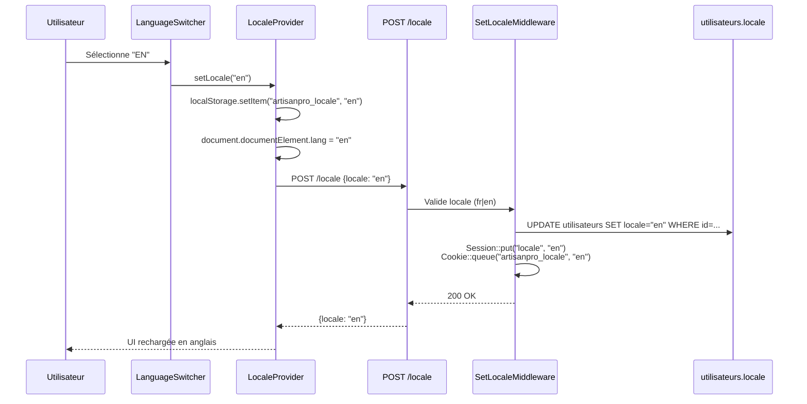
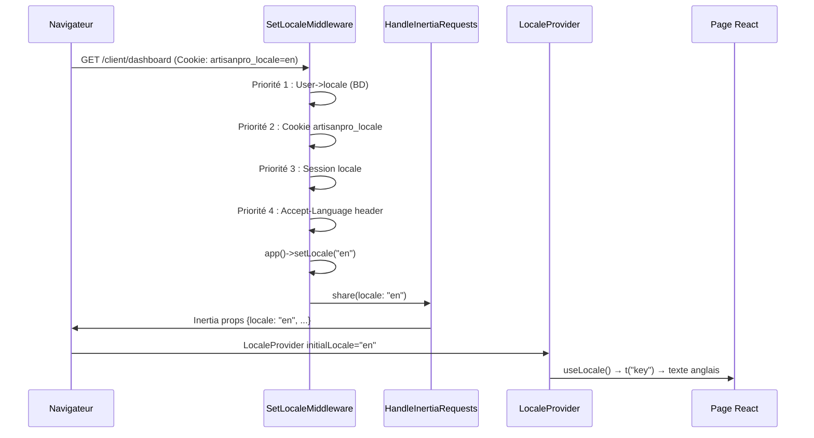
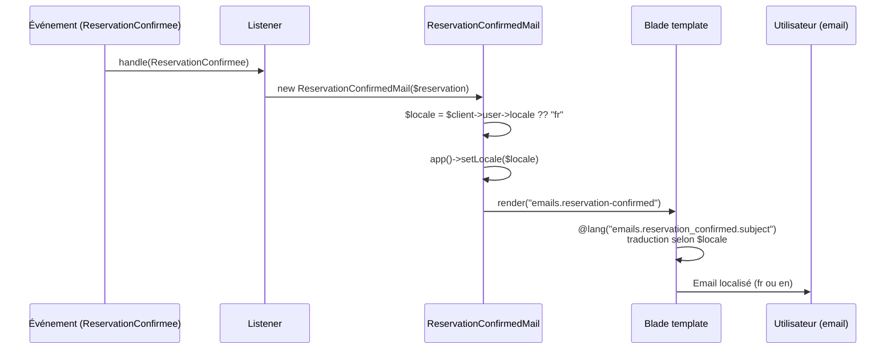

# Document de conception : Support Bilingue Complet (fr/en)

## Overview

ArtisanPro dispose déjà d'une infrastructure i18n custom côté frontend (`locale-context.tsx`, `translations.ts`, `LanguageSwitcher`) et d'un `LocaleProvider` enveloppant toute l'application. Cependant, seules les pages publiques (accueil, annuaire, navbar publique) utilisent réellement ces traductions. L'objectif est d'**étendre le support bilingue français/anglais à 100 % des pages** — interfaces authentifiées (client, artisan, admin), pages auth, emails, SMS et notifications — avec une persistance cohérente du choix de langue entre le frontend et le backend Laravel.

Le périmètre ciblé couvre : (1) l'achèvement des clés de traduction frontend manquantes, (2) l'exposition du `LanguageSwitcher` dans tous les layouts, (3) la synchronisation de la langue vers Laravel via cookie/session, (4) la création d'un système de traductions backend (`lang/fr/` et `lang/en/`), (5) la localisation des emails et SMS, et (6) la persistance de la préférence de langue par utilisateur en base.

---

## Architecture

```mermaid
graph TD
    subgraph Frontend ["Frontend (React/Inertia/TypeScript)"]
        LP[LocaleProvider]
        LS[LanguageSwitcher]
        TR[translations.ts<br/>clés fr + en]
        UL[useLocale hook]
        AL[AppLayout]
        ADL[AdminLayout]
        AUTH[AuthLayout]
        PAGES[Pages authentifiées<br/>client · artisan · admin · auth]
    end

    subgraph Backend ["Backend (Laravel 10)"]
        MW[SetLocaleMiddleware]
        LANG[lang/fr/*.php<br/>lang/en/*.php]
        LC[LocaleController]
        UM[User.locale colonne]
        NOTIF[Notifications<br/>Mailable + SMS]
    end

    subgraph Persistence ["Persistance"]
        CK[Cookie artisanpro_locale]
        LS2[localStorage artisanpro_locale]
        DB[(DB utilisateurs.locale)]
    end

    LS -->|setLocale| LP
    LP --> UL
    UL --> PAGES
    LS --> LC
    LC -->|POST /locale| MW
    MW --> LANG
    MW --> UM
    LP <-->|lecture initiale| LS2
    LC <-->|cookie| CK
    MW -->|app()->setLocale| NOTIF
    UM --> DB
```

---

## Diagrammes de séquence

### Changement de langue (utilisateur authentifié)



### Résolution de locale au démarrage



### Notification email multilingue



---

## Components and Interfaces

### Composant 1 : `LanguageSwitcher` (amélioré)

**Rôle** : Sélecteur de langue accessible depuis tous les layouts (public, app, admin, auth).

**Interface actuelle** : Le composant existe déjà dans `resources/js/components/language-switcher.tsx`. Il reçoit `locale` et `onLocaleChange` en props et affiche un dropdown avec drapeaux.

**Améliorations requises** :
- Appel HTTP `POST /locale` à chaque changement pour synchroniser le backend
- Filtrage optionnel à fr/en uniquement via prop `supportedLocales`
- Accessible (aria-label, rôle `combobox`)

**Responsabilités** :
- Afficher la langue active
- Déclencher `setLocale(l)` du contexte
- Persister via `localStorage` (déjà fait dans `LocaleProvider`)
- Notifier le backend via POST

### Composant 2 : `LocaleProvider` (amélioré)

**Rôle** : Fournit `locale`, `setLocale`, `t()` à tout l'arbre React.

**Fichier** : `resources/js/i18n/locale-context.tsx`

**Améliorations requises** :
- Accepter une prop `initialLocale` injectée par le serveur via les props Inertia partagées
- Priorité de résolution : `initialLocale` (serveur) > `localStorage` > `navigator.language` > `fr`

**Interface** :
```typescript
interface LocaleContextValue {
    locale: Locale;
    setLocale: (l: Locale) => void;
    t: (key: string, params?: Record<string, string>, fallback?: string) => string;
}

interface LocaleProviderProps {
    children: ReactNode;
    initialLocale?: Locale; // injecté depuis usePage().props.locale
}
```

### Composant 3 : `AppLayout` (amélioré)

**Rôle** : Layout principal des pages client et artisan authentifiées.

**Améliorations requises** :
- Intégrer `LanguageSwitcher` dans la barre supérieure (top bar)
- Utiliser `t()` pour les labels de navigation (sidebar items)
- Utiliser `t()` pour les libellés "Voir le site", "Déconnexion"

**Position du sélecteur** : Dans le `<header>`, à droite, avant la cloche et le profil.

### Composant 4 : `AdminLayout` (amélioré)

**Rôle** : Layout des pages d'administration.

**Améliorations requises** :
- Intégrer `LanguageSwitcher` dans la top bar admin
- Utiliser `t()` pour les items de navigation admin

### Composant 5 : `AuthLayout` (amélioré)

**Rôle** : Layout des pages d'authentification (login, register, forgot-password…).

**Améliorations requises** :
- Intégrer un `LanguageSwitcher` en haut à droite de la page
- Les pages auth (`login.tsx`, `register.tsx`…) doivent utiliser `t()` pour tous les labels

---

## Data Models

### Modèle 1 : User (mise à jour)

Ajout d'une colonne `locale` à la table `utilisateurs`.

```
Migration : add_locale_to_utilisateurs_table
Colonne   : locale VARCHAR(5) NULL DEFAULT NULL
Contrainte: CHECK locale IN ('fr', 'en') OR NULL
Index     : aucun (lecture unique, faible cardinalité)
```

**Règles de validation** :
- Valeurs acceptées : `'fr'`, `'en'`
- `NULL` signifie "pas de préférence enregistrée" → fallback sur cookie/session/navigateur
- Mise à jour via `PATCH /locale` ou page profil

**Représentation dans `User.php`** :
```php
protected $fillable = [
    // ... existant
    'locale',
];

protected function casts(): array
{
    return [
        // ... existant
        'locale' => 'string',
    ];
}
```

**Représentation dans `SharedData` (TypeScript)** :
```typescript
interface SharedData {
    // ... existant
    locale: 'fr' | 'en'; // injecté par HandleInertiaRequests
}

interface User {
    // ... existant
    locale?: 'fr' | 'en' | null;
}
```

### Modèle 2 : Fichiers de traductions backend

Structure des fichiers `lang/` de Laravel :

```
lang/
├── fr/
│   ├── auth.php           // messages d'authentification
│   ├── validation.php     // messages de validation
│   ├── emails.php         // sujets et corps d'emails
│   ├── notifications.php  // textes de notifications in-app
│   └── sms.php            // templates SMS
└── en/
    ├── auth.php
    ├── validation.php
    ├── emails.php
    ├── notifications.php
    └── sms.php
```

**Structure de `lang/fr/emails.php`** :
```php
return [
    'reservation_confirmed' => [
        'subject' => 'Votre réservation #:id est confirmée',
        'greeting' => 'Bonjour :name,',
        'body'    => 'Votre réservation avec :artisan est confirmée pour le :date.',
        'footer'  => "Merci d'avoir choisi ArtisanPro.",
    ],
    'reservation_rejected' => [
        'subject' => 'Votre réservation #:id a été refusée',
        'greeting' => 'Bonjour :name,',
        'body'    => "Votre réservation avec :artisan a été refusée.",
        'footer'  => "Contactez-nous pour plus d'informations.",
    ],
    'contrat_finalise' => [
        'subject' => 'Votre contrat :numero est finalisé',
        'greeting' => 'Bonjour,',
        'body'    => "Le contrat :numero entre :client et :artisan a été signé.",
        'footer'  => 'Consultez votre espace ArtisanPro.',
    ],
];
```

**Structure de `lang/fr/sms.php`** :
```php
return [
    'reservation_confirmed' => "ArtisanPro : Votre réservation #:id avec :artisan est confirmée pour le :date.",
    'reservation_rejected'  => "ArtisanPro : Votre réservation #:id avec :artisan a été annulée.",
    'contrat_finalise'      => "ArtisanPro : Votre contrat :numero a été signé. Consultez votre espace.",
    'litige_ouvert'         => "ArtisanPro : Un litige #:id a été ouvert. Répondez dans les 72h.",
    'inscription'           => "ArtisanPro : Bienvenue :name ! Votre compte est activé.",
];
```

### Modèle 3 : Clés de traductions frontend manquantes

Le fichier `translations.ts` doit être enrichi des namespaces suivants pour couvrir toutes les pages :

```typescript
// Namespaces à ajouter dans translations.ts (fr + en)
'app.nav.dashboard'        // "Tableau de bord" / "Dashboard"
'app.nav.reservations'     // "Réservations" / "Reservations"
'app.nav.devis'            // "Mes Devis" / "My Quotes"
'app.nav.messages'         // "Messages" / "Messages"
'app.nav.paiements'        // "Paiements" / "Payments"
'app.nav.avis'             // "Mes Avis" / "My Reviews"
'app.nav.favoris'          // "Favoris" / "Favorites"
'app.nav.litiges'          // "Litiges" / "Disputes"
'app.nav.notifications'    // "Notifications" / "Notifications"
'app.nav.profil'           // "Mon Profil" / "My Profile"
'app.nav.revenus'          // "Mes Revenus" / "My Earnings"
'app.nav.portfolio'        // "Portfolio" / "Portfolio"
'app.nav.academie'         // "Académie" / "Academy"
'app.nav.geolocalisation'  // "Géolocalisation" / "Geolocation"
'app.nav.planning'         // "Planning" / "Planning"
'app.nav.see_site'         // "Voir le site" / "View site"
'app.nav.logout'           // "Déconnexion" / "Log out"

// Admin nav
'admin.nav.dashboard'      // "Tableau de bord" / "Dashboard"
'admin.nav.users'          // "Utilisateurs" / "Users"
'admin.nav.artisans'       // "Artisans" / "Craftsmen"
'admin.nav.categories'     // "Catégories" / "Categories"
'admin.nav.reservations'   // "Réservations" / "Reservations"
'admin.nav.paiements'      // "Paiements" / "Payments"
'admin.nav.avis'           // "Avis" / "Reviews"
'admin.nav.litiges'        // "Litiges" / "Disputes"
'admin.nav.partenaires'    // "Partenaires" / "Partners"
'admin.nav.rapports'       // "Rapports" / "Reports"
'admin.nav.sms'            // "SMS" / "SMS"
'admin.nav.profil'         // "Profil" / "Profile"
'admin.label'              // "Administration" / "Administration"

// Auth pages
'auth.login.title'         // "Bon retour !" / "Welcome back!"
'auth.login.subtitle'      // "Connectez-vous pour accéder à votre espace" / "Sign in to access your account"
'auth.login.email_phone'   // "Email ou numéro de téléphone" / "Email or phone number"
'auth.login.password'      // "Mot de passe" / "Password"
'auth.login.forgot'        // "Mot de passe oublié ?" / "Forgot password?"
'auth.login.remember'      // "Se souvenir de moi" / "Remember me"
'auth.login.submit'        // "Se connecter" / "Sign in"
'auth.login.no_account'    // "Pas encore de compte ?" / "No account yet?"
'auth.login.create'        // "Créer un compte" / "Create an account"
'auth.register.title'      // "Créer un compte" / "Create an account"
'auth.register.submit'     // "S'inscrire" / "Sign up"

// Statuts et champs communs
'common.status.pending'    // "En attente" / "Pending"
'common.status.confirmed'  // "Confirmée" / "Confirmed"
'common.status.cancelled'  // "Annulée" / "Cancelled"
'common.status.completed'  // "Terminée" / "Completed"
'common.confirm'           // "Confirmer" / "Confirm"
'common.refuse'            // "Refuser" / "Refuse"
'common.back'              // "Retour" / "Back"
'common.save'              // "Enregistrer" / "Save"
'common.cancel'            // "Annuler" / "Cancel"
'common.loading'           // "Chargement…" / "Loading…"
'common.no_data'           // "Aucune donnée disponible" / "No data available"
'common.currency'          // "FCFA" / "FCFA"
```

---

## Error Handling

### Scénario 1 : Locale invalide soumise au backend

**Condition** : `POST /locale` avec `{locale: "zh"}` (non supportée)  
**Réponse** : HTTP 422 avec `{errors: {locale: ["Locale non supportée."]}}`  
**Récupération** : Le frontend ignore l'erreur silencieusement, conserve la locale actuelle

### Scénario 2 : Traduction manquante (clé absente)

**Condition** : `t("une.cle.inexistante")` appelé côté frontend  
**Réponse** : Le système retourne la clé brute (comportement existant de `locale-context.tsx`)  
**Récupération** : Fallback fr → fallback `key` → texte affiché sans crash

### Scénario 3 : Fichier de langue Laravel manquant

**Condition** : `__('emails.reservation_confirmed.subject')` sans fichier `lang/fr/emails.php`  
**Réponse** : Laravel retourne la clé brute  
**Récupération** : Email envoyé avec la clé brute — dégradation gracieuse, pas d'exception

### Scénario 4 : User.locale NULL en base

**Condition** : Utilisateur existant sans colonne `locale` remplie  
**Réponse** : `SetLocaleMiddleware` utilise l'ordre de priorité : cookie > session > `Accept-Language` > `fr`  
**Récupération** : Locale fonctionnelle sans intervention utilisateur

---

## Correctness Properties

### Property 1: Symétrie des clés fr/en (propriété universelle)

Pour toute clé `k` définie dans `translations['fr']`, `translations['en'][k]` doit exister et être une chaîne non vide. Aucune clé ne peut être présente dans une seule langue.

```typescript
// fast-check — à exécuter dans tests/i18n/translations.test.ts
fc.assert(
  fc.property(fc.constantFrom(...Object.keys(translations['fr'])), (key) =>
    typeof translations['en'][key] === 'string' && translations['en'][key].length > 0
  )
);
```

### Property 2: Idempotence du changement de locale

Appeler `setLocale('fr')` deux fois de suite produit exactement le même état observable (`locale === 'fr'`, `document.documentElement.lang === 'fr'`, `localStorage === 'fr'`) que l'appeler une seule fois.

### Property 3: Absence de régression textuelle

Après intégration, aucun composant dans `AppLayout`, `AdminLayout`, `AuthLayout` et les pages associées ne doit contenir de chaîne littérale française ou anglaise codée en dur (non passée par `t()`). Cette propriété est vérifiable statiquement par un script de grep ou une règle ESLint custom.

### Property 4: Cohérence frontend/backend

Pour tout utilisateur authentifié ayant `locale = "en"` en base, toute notification email et tout SMS émis par une action de cet utilisateur doivent être rédigés en anglais. Si `locale = "fr"` ou `NULL`, le contenu doit être en français.

### Property 5: Persistance de la locale entre navigations

Si l'utilisateur sélectionne "EN" sur la page `/client/dashboard`, navigue vers `/client/reservations`, puis revient, la locale doit toujours être "en" — que ce soit via `localStorage`, cookie ou prop Inertia partagée.

---

## Testing Strategy

### Tests unitaires

- `LocaleProvider` : résolution de locale (ordre de priorité des sources)
- `LanguageSwitcher` : rendu, interaction clic, appel POST
- Clés de traductions : toutes les clés `fr` ont un équivalent `en` (test d'exhaustivité TypeScript)
- `SetLocaleMiddleware` : validation, fallback, écriture session/cookie/DB

### Tests basés sur les propriétés

**Bibliothèque** : `fast-check` (frontend TypeScript)

**Propriété 1 — Symétrie des clés de traduction** :
Pour toute clé `k` définie dans `translations['fr']`, `translations['en'][k]` doit exister et être une chaîne non vide.
```typescript
fc.property(fc.constantFrom(...Object.keys(translations['fr'])), (key) => {
    return typeof translations['en'][key] === 'string' && translations['en'][key].length > 0;
})
```

**Propriété 2 — Idempotence du sélecteur de locale** :
Appeler `setLocale('fr')` deux fois produit le même état que l'appeler une fois.

**Propriété 3 — Exhaustivité des namespaces** :
Pour tout namespace de page (ex. `app.nav.*`), il existe au moins une clé par section documentée.

### Tests d'intégration

- Navigation complète client (fr → en) : vérifier que les libellés changent
- Navigation complète artisan (fr → en)
- Navigation admin (fr → en)
- Pages auth (login, register) en fr et en
- POST `/locale` : persistance en BD et cookie
- Email `ReservationConfirmedMail` : génération en fr et en

### Tests de régression

- Aucun texte français codé en dur ne doit subsister dans les composants mis à jour (ESLint rule ou grep custom)
- Le `LanguageSwitcher` doit être visible (snapshot test) dans AppLayout, AdminLayout et AuthLayout

---

## Considérations de performance

- Les fichiers de traduction frontend (`translations.ts`) sont **statiques** et bundlés à la compilation — zéro requête réseau pour la résolution des clés
- Le `POST /locale` est déclenché **uniquement lors du changement** de langue par l'utilisateur, pas à chaque navigation
- Le cookie `artisanpro_locale` est lu une seule fois par `SetLocaleMiddleware` au démarrage de chaque requête HTTP — overhead négligeable
- La colonne `locale` sur `utilisateurs` est de type `VARCHAR(5)` — impact mémoire minimal
- Les traductions backend (`lang/fr/*.php`) sont mises en cache par OPcache — pas de surcoût en production

---

## Considérations de sécurité

- La valeur de locale acceptée est validée contre un enum `['fr', 'en']` côté backend — pas d'injection possible
- Le cookie `artisanpro_locale` est `HttpOnly: false` (lu par JS) et `SameSite=Lax` — pas de données sensibles
- Aucune traduction ne contient de données utilisateur — pas de risque XSS via les chaînes i18n
- Les templates email en Blade continuent d'utiliser `{{ }}` (auto-escapé) pour les variables dynamiques

---

## Dépendances

| Couche       | Dépendance                  | Statut         | Usage                                      |
|--------------|-----------------------------|----------------|--------------------------------------------|
| Frontend     | `@/i18n/locale-context.tsx` | Existant       | Contexte de langue, `useLocale`            |
| Frontend     | `@/i18n/translations.ts`    | À enrichir     | Ajouter ~60 nouvelles clés fr+en           |
| Frontend     | `@/components/language-switcher.tsx` | À enrichir | Ajout appel POST `/locale`          |
| Frontend     | `@/layouts/app-layout.tsx`  | À modifier     | Intégrer `LanguageSwitcher` + `t()`        |
| Frontend     | `@/layouts/admin-layout.tsx`| À modifier     | Intégrer `LanguageSwitcher` + `t()`        |
| Frontend     | `@/layouts/auth-layout.tsx` | À modifier     | Intégrer `LanguageSwitcher`                |
| Backend      | `lang/fr/*.php`             | À créer        | Traductions emails, SMS, notifications     |
| Backend      | `lang/en/*.php`             | À créer        | Idem en anglais                            |
| Backend      | `SetLocaleMiddleware`       | À créer        | Résolution et persistance de locale        |
| Backend      | `LocaleController`          | À créer        | Endpoint `POST /locale`                    |
| Backend      | Migration `add_locale_to_utilisateurs_table` | À créer | Colonne `locale` sur User      |
| Backend      | `HandleInertiaRequests`     | À modifier     | Partager `locale` dans les props Inertia   |
| Backend      | `SmsNotificationService`    | À modifier     | Utiliser `lang/fr/sms.php` et `lang/en/sms.php` |
| Backend      | Templates emails Blade      | À modifier     | Utiliser `@lang()` au lieu du texte en dur |
