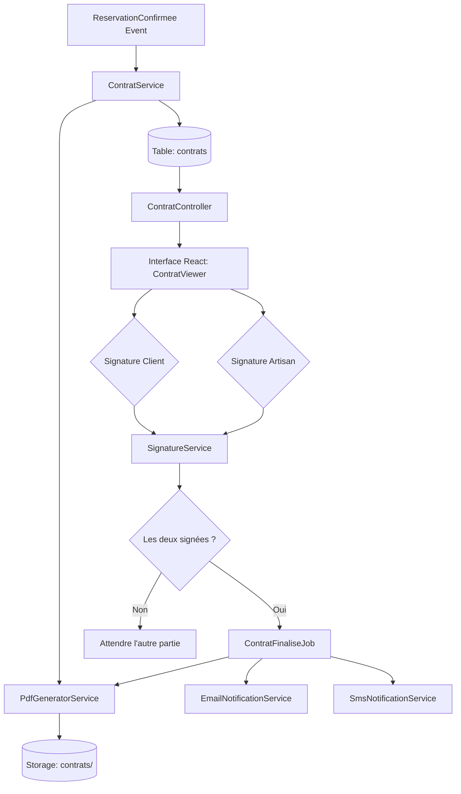
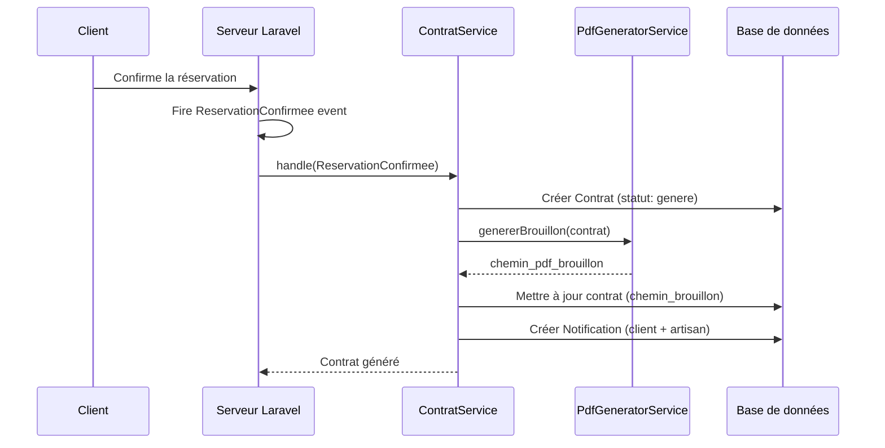
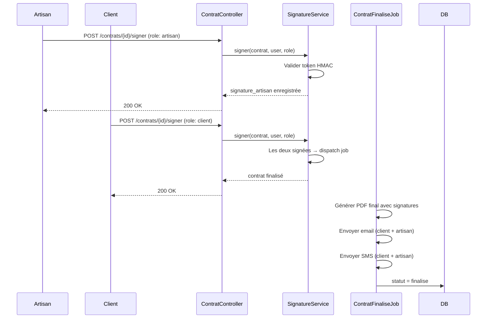

# Document de Conception — Contrat de Réservation

## Vue d'ensemble

Cette fonctionnalité introduit la génération automatique d'un contrat d'accord lors de toute réservation confirmée entre un client et un artisan sur ArtisanPro. Chaque partie signe électroniquement le contrat via une touche d'approbation ; une fois les deux signatures recueillies, le contrat final (PDF) est transmis aux deux parties par email et SMS. Le contrat intègre également des clauses de résolution des litiges qui s'articulent avec le système de litiges existant (`Litige`).

Le module s'insère dans le workflow Laravel existant (événements, queues, notifications) sans modifier les modèles `Reservation`, `Litige` ou `Paiement` — il ajoute une couche contractuelle orthogonale.

---

## Architecture



---

## Diagrammes de séquence

### Génération du contrat à la confirmation



### Workflow de double signature



---

## Composants et interfaces

### ContratService

**Rôle** : Orchestrateur principal — créé le contrat en base, déclenche la génération PDF du brouillon, notifie les parties.

**Interface** :
```php
interface ContratServiceInterface
{
    // Appelé depuis le listener ReservationConfirmeeListener
    public function creerDepuisReservation(Reservation $reservation): Contrat;

    // Retourner les données pour l'affichage (React)
    public function getContratPourReservation(int $reservationId): ?Contrat;
}
```

**Responsabilités** :
- Vérifier qu'un contrat n'existe pas déjà pour cette réservation (idempotence)
- Calculer le contenu dynamique (noms, montants, dates, clauses)
- Persister le modèle `Contrat` avec `statut = 'genere'`
- Déléguer la génération du brouillon PDF à `PdfGeneratorService`
- Créer les notifications in-app pour client et artisan

### PdfGeneratorService

**Rôle** : Génère les fichiers PDF (brouillon sans signature + final avec signature) via la bibliothèque [barryvdh/laravel-dompdf](https://github.com/barryvdh/laravel-dompdf).

**Interface** :
```php
interface PdfGeneratorServiceInterface
{
    // PDF brouillon (watermark "À SIGNER")
    public function genererBrouillon(Contrat $contrat): string; // chemin storage

    // PDF final (après les 2 signatures, mentions légales + hash signatures)
    public function genererFinal(Contrat $contrat): string; // chemin storage
}
```

**Responsabilités** :
- Charger le template Blade `resources/views/pdf/contrat.blade.php`
- Injecter les données du contrat (parties, clauses, signatures)
- Stocker dans `storage/app/contrats/{reservation_id}/brouillon.pdf` et `final.pdf`
- Retourner le chemin relatif stocké en base

### SignatureService

**Rôle** : Gère l'apposition d'une signature électronique (horodatage + empreinte HMAC).

**Interface** :
```php
interface SignatureServiceInterface
{
    // role: 'client' | 'artisan'
    public function signer(Contrat $contrat, User $user, string $role): Contrat;

    // Vérifier l'intégrité d'une signature
    public function verifier(Contrat $contrat, string $role): bool;
}
```

**Responsabilités** :
- Valider que `$user` est bien la partie attendue pour ce `$role`
- Enregistrer `signature_client_at` / `signature_artisan_at` + hash HMAC dans la colonne correspondante
- Si les deux signatures sont présentes → dispatch `ContratFinaliseJob`
- Protéger contre la double-signature (idempotence)

### ContratFinaliseJob (Queue Job)

**Rôle** : Tâche asynchrone déclenchée après la deuxième signature.

**Responsabilités** :
- Générer le PDF final via `PdfGeneratorService::genererFinal()`
- Envoyer l'email avec le PDF en pièce jointe (client + artisan) via `Mail::to()`
- Envoyer le SMS de notification via `SmsNotificationService::envoyerContratFinalise()`
- Mettre à jour `contrat.statut = 'finalise'`
- Logger toute erreur sans lever d'exception (fail silently avec retry)

### ContratController

**Rôle** : Expose les routes HTTP pour consultation et signature.

**Interface** :
```php
// Routes Portal
Route::prefix('portal/contrats')->middleware('auth')->group(function () {
    Route::get('/{contrat}', [ContratController::class, 'show']);
    Route::post('/{contrat}/signer', [ContratController::class, 'signer']);
    Route::get('/{contrat}/telecharger', [ContratController::class, 'telecharger']);
});

// Routes Admin (lecture seule)
Route::prefix('admin/contrats')->middleware(['auth', 'admin'])->group(function () {
    Route::get('/', [Admin\ContratController::class, 'index']);
    Route::get('/{contrat}', [Admin\ContratController::class, 'show']);
});
```

---

## Modèle de données

### Table `contrats`

```sql
CREATE TABLE contrats (
    id                      BIGINT UNSIGNED AUTO_INCREMENT PRIMARY KEY,
    id_reservation          BIGINT UNSIGNED NOT NULL UNIQUE,
    id_client               BIGINT UNSIGNED NOT NULL,
    id_artisan              BIGINT UNSIGNED NOT NULL,

    -- Données du contrat (snapshot au moment de la génération)
    numero_contrat          VARCHAR(30) NOT NULL UNIQUE,  -- CP-2025-00001
    nom_client              VARCHAR(255) NOT NULL,
    nom_artisan             VARCHAR(255) NOT NULL,
    description_prestation  TEXT NOT NULL,
    montant_total           DECIMAL(12,2) NOT NULL,
    date_debut_prestation   DATETIME NOT NULL,
    date_fin_prestation     DATETIME NULL,
    adresse_intervention    TEXT NULL,

    -- Statut du cycle de vie
    statut                  ENUM('genere','en_attente_signatures','partiellement_signe',
                                 'finalise','annule') NOT NULL DEFAULT 'genere',

    -- Signatures électroniques
    signature_client_at     DATETIME NULL,
    signature_client_hash   VARCHAR(128) NULL,  -- HMAC-SHA256
    signature_artisan_at    DATETIME NULL,
    signature_artisan_hash  VARCHAR(128) NULL,

    -- Fichiers PDF
    chemin_pdf_brouillon    VARCHAR(500) NULL,
    chemin_pdf_final        VARCHAR(500) NULL,

    -- Clauses de litige (JSON pour flexibilité)
    clauses_litige          JSON NULL,

    -- Audit
    genere_at               TIMESTAMP NULL,
    finalise_at             TIMESTAMP NULL,
    created_at              TIMESTAMP NULL,
    updated_at              TIMESTAMP NULL,

    FOREIGN KEY (id_reservation) REFERENCES reservations(id) ON DELETE RESTRICT,
    FOREIGN KEY (id_client)      REFERENCES clients(id) ON DELETE RESTRICT,
    FOREIGN KEY (id_artisan)     REFERENCES artisans(id) ON DELETE RESTRICT
);
```

**Modèle Eloquent `Contrat`** :

```php
// app/Models/Contrat.php
class Contrat extends Model
{
    protected $fillable = [
        'id_reservation', 'id_client', 'id_artisan',
        'numero_contrat', 'nom_client', 'nom_artisan',
        'description_prestation', 'montant_total',
        'date_debut_prestation', 'date_fin_prestation', 'adresse_intervention',
        'statut',
        'signature_client_at', 'signature_client_hash',
        'signature_artisan_at', 'signature_artisan_hash',
        'chemin_pdf_brouillon', 'chemin_pdf_final',
        'clauses_litige', 'genere_at', 'finalise_at',
    ];

    protected $casts = [
        'date_debut_prestation' => 'datetime',
        'date_fin_prestation'   => 'datetime',
        'signature_client_at'   => 'datetime',
        'signature_artisan_at'  => 'datetime',
        'clauses_litige'        => 'array',
        'montant_total'         => 'decimal:2',
        'genere_at'             => 'datetime',
        'finalise_at'           => 'datetime',
    ];

    public function reservation(): BelongsTo  { return $this->belongsTo(Reservation::class, 'id_reservation'); }
    public function client(): BelongsTo       { return $this->belongsTo(Client::class, 'id_client'); }
    public function artisan(): BelongsTo      { return $this->belongsTo(Artisan::class, 'id_artisan'); }

    // Helpers
    public function estSigne(): bool {
        return $this->signature_client_at !== null && $this->signature_artisan_at !== null;
    }
}
```

### Clauses de litige (structure JSON)

La colonne `clauses_litige` stocke les clauses prédéfinies sous forme de tableau :

```json
[
  {
    "id": "delai_reclamation",
    "titre": "Délai de réclamation",
    "contenu": "Toute réclamation doit être soumise dans un délai de 7 jours suivant la fin de la prestation."
  },
  {
    "id": "motifs_litige",
    "titre": "Motifs de litige acceptés",
    "contenu": "Les motifs acceptés sont : travaux non réalisés, qualité insuffisante, désaccord tarifaire."
  },
  {
    "id": "mediation",
    "titre": "Médiation ArtisanPro",
    "contenu": "En cas de désaccord, les parties acceptent la médiation par l'équipe ArtisanPro comme première étape obligatoire."
  },
  {
    "id": "arbitrage_fonds",
    "titre": "Gestion des fonds en litige",
    "contenu": "Les fonds placés en séquestre restent gelés jusqu'à décision de l'administrateur ArtisanPro."
  }
]
```

---

## Interface React — ContratViewer

### Composant principal

```tsx
// resources/js/pages/portal/contrat-viewer.tsx
interface ContratViewerProps {
    contrat: {
        id: number;
        numero_contrat: string;
        statut: 'genere' | 'en_attente_signatures' | 'partiellement_signe' | 'finalise' | 'annule';
        nom_client: string;
        nom_artisan: string;
        description_prestation: string;
        montant_total: number;
        date_debut_prestation: string;
        adresse_intervention: string | null;
        signature_client_at: string | null;
        signature_artisan_at: string | null;
        clauses_litige: ClauseLitige[];
        chemin_pdf_brouillon: string | null;
        chemin_pdf_final: string | null;
    };
    role_utilisateur: 'client' | 'artisan';
    peut_signer: boolean; // true si l'utilisateur n'a pas encore signé
}

interface ClauseLitige {
    id: string;
    titre: string;
    contenu: string;
}
```

### États d'affichage

| Statut contrat          | Affichage                                           |
|-------------------------|-----------------------------------------------------|
| `genere`                | Brouillon PDF + bouton "Signer"                     |
| `en_attente_signatures` | Bouton "Signer" actif pour la partie concernée      |
| `partiellement_signe`   | Indicateur "En attente de l'autre partie"           |
| `finalise`              | Badge ✓ vert + bouton "Télécharger PDF final"       |
| `annule`                | Badge ✗ rouge + message explicatif                  |

---

## Numérotation des contrats

Format : `CP-AAAA-NNNNN`
- `CP` : préfixe "Contrat Prestation"
- `AAAA` : année courante (ex. 2025)
- `NNNNN` : numéro séquentiel sur 5 chiffres, remis à zéro chaque année

Généré dans `ContratService::genererNumero()` avec un verrou DB (`DB::transaction` + `lockForUpdate`) pour garantir l'unicité sous charge.

---

## Gestion des erreurs

| Scénario | Comportement |
|----------|-------------|
| Contrat déjà existant pour la réservation | `ContratService::creerDepuisReservation()` retourne le contrat existant sans créer de doublon |
| Génération PDF échoue | Log d'erreur, `statut` reste `genere`, retry via queue avec backoff exponentiel (3 tentatives) |
| Envoi email échoue | `ContratFinaliseJob` loggue l'erreur, le contrat reste `finalise` — l'utilisateur peut retélécharger |
| Tentative de double-signature | `SignatureService` retourne le contrat inchangé avec message info |
| Réservation annulée après génération | Contrat passé en `annule` via listener `ReservationAnnulee` |

---

## Stratégie de test

### Tests unitaires

- `ContratServiceTest` : génération idempotente, numérotation séquentielle, données snapshot correctes
- `SignatureServiceTest` : validation HMAC, protection double-signature, déclenchement job après 2ème signature
- `PdfGeneratorServiceTest` : création fichier, chemin de stockage correct

### Tests d'intégration

- Scénario complet : création réservation → confirmation → génération contrat → signature client → signature artisan → envoi email/SMS
- Scénario partiel : signature d'un seul côté → vérifier `statut = partiellement_signe`
- Scénario annulation : réservation annulée → contrat en `annule`

### Tests de propriété

**Librairie** : PestPHP avec Faker

- `∀ réservation confirmée → exactement 1 contrat généré` (idempotence)
- `∀ contrat finalisé → signature_client_at ≠ null ∧ signature_artisan_at ≠ null`
- `∀ numéro de contrat → format CP-AAAA-NNNNN et unicité globale`

---

## Considérations de sécurité

- **Signature HMAC** : chaque signature est un `hash_hmac('sha256', $payload, config('app.key'))` où `$payload = "{$contrat->id}|{$role}|{$timestamp}"`. Cela lie la signature à un contrat, un rôle et un moment précis.
- **Contrôle d'accès** : un client ne peut signer que son propre contrat (`id_client`), un artisan que le sien (`id_artisan`) — vérifié par policy `ContratPolicy`.
- **PDF en accès contrôlé** : les fichiers sont dans `storage/app/contrats/` (non public). La route `telecharger` génère une réponse streamed après vérification des droits.
- **Données snapshot** : les noms, montants et descriptions sont copiés au moment de la génération pour éviter toute modification a posteriori.

---

## Intégration avec les systèmes existants

### Événements Laravel

```php
// Listener existant à enrichir
class ReservationConfirmeeListener {
    public function handle(ReservationConfirmee $event): void {
        // ... logique existante
        app(ContratService::class)->creerDepuisReservation($event->reservation);
    }
}

// Nouveau listener
class ReservationAnnuleeListener {
    public function handle(ReservationAnnulee $event): void {
        $contrat = Contrat::where('id_reservation', $event->reservation->id)->first();
        $contrat?->update(['statut' => 'annule']);
    }
}
```

### SmsNotificationService — méthode ajoutée

```php
public function envoyerContratFinalise(string $telephone, string $numeroContrat, ?User $user = null): void;
// SMS : "ArtisanPro : Votre contrat {$numeroContrat} a été signé par les deux parties. Consultez votre espace."
```

### Lien avec Litige

La colonne `clauses_litige` du contrat est affichée dans `Interface_Admin_Litige` pour rappeler les conditions contractuelles acceptées par les deux parties lors de l'ouverture d'un litige. Aucune modification du modèle `Litige` n'est nécessaire.

---

## Dépendances

| Dépendance | Usage | Package |
|------------|-------|---------|
| `barryvdh/laravel-dompdf` | Génération PDF | Composer |
| Laravel Queues (existant) | `ContratFinaliseJob` | natif |
| Laravel Mail (existant) | Envoi email avec PJ PDF | natif |
| `SmsNotificationService` (existant) | SMS de finalisation | interne |
| `Notification::notifier()` (existant) | Notifications in-app | interne |
| `ContratPolicy` (nouveau) | Contrôle d'accès signature/téléchargement | interne |
