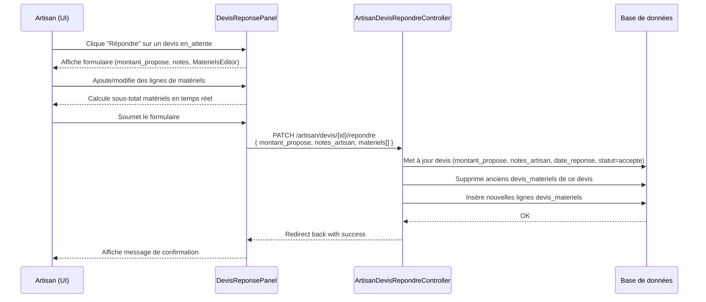
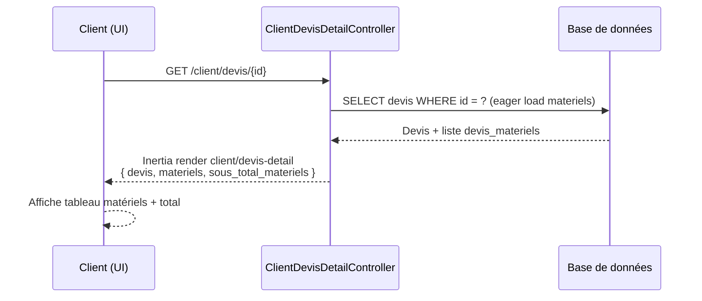

# Document de Design — Liste de Matériels dans le Devis Artisan

## Vue d'ensemble

Cette fonctionnalité permet à un artisan d'inclure une liste détaillée de matériels nécessaires à l'exécution d'un travail directement dans le devis qu'il adresse à un client. Chaque ligne de matériel contient un nom, une quantité, un prix unitaire et une unité de mesure. Le total des matériels est intégré dans le calcul du montant total du devis et rendu visible au client sur la page de consultation du devis.

Le périmètre couvre : (1) la saisie et la gestion de la liste côté artisan sur la page `/artisan/devis`, (2) l'affichage de la liste côté client, (3) la persistance en base de données via une nouvelle table `devis_materiels`, et (4) l'intégration dans le calcul du montant total du devis.

---

## Architecture

```mermaid
graph TD
    subgraph Frontend React/Inertia
        A[Page artisan/devis - Liste des devis] -->|Ouvre le panneau de réponse| B[Composant DevisReponsePanel]
        B --> C[Composant MaterielsEditor<br/>Saisie ligne par ligne]
        D[Page client/devis - Détail devis] --> E[Composant MaterielsReadOnly<br/>Affichage client]
    end

    subgraph Backend Laravel
        F[DevisStoreController<br/>POST /devis] --> G[Devis Model]
        H[ArtisanDevisRepondreController<br/>PATCH /artisan/devis/:id/repondre] --> G
        H --> I[DevisMateriel Model]
        J[ArtisanDevisController<br/>GET /artisan/devis/:id] --> G
        J --> I
        K[ClientDevisController<br/>GET /client/devis/:id] --> G
        K --> I
    end

    subgraph Base de données
        G -->|id| L[(Table devis)]
        I -->|id_devis FK| M[(Table devis_materiels)]
    end

    B -->|PATCH /artisan/devis/:id/repondre| H
    E -->|GET /client/devis/:id| K
    C -->|données JSON materiels[]| H
```

---

## Diagrammes de séquence

### Séquence 1 : L'artisan répond à un devis avec une liste de matériels



### Séquence 2 : Le client consulte le devis avec la liste de matériels



---

## Composants et Interfaces

### Composant 1 : `MaterielsEditor` (React)

**Rôle** : Éditeur interactif de la liste de matériels côté artisan. Permet d'ajouter, modifier et supprimer des lignes. Calcule le sous-total à la volée.

**Interface TypeScript** :

```typescript
interface LigneMateriel {
    id?: number          // présent si ligne existante en BDD
    nom: string          // ex. "Ciment Portland"
    quantite: number     // ex. 5
    unite: string        // ex. "sacs", "m", "m²", "unité", "kg", "L"
    prix_unitaire: number // en FCFA
    sous_total: number   // calculé : quantite * prix_unitaire (lecture seule)
}

interface MaterielsEditorProps {
    value: LigneMateriel[]
    onChange: (lignes: LigneMateriel[]) => void
    disabled?: boolean
}
```

**Responsabilités** :
- Rendre un tableau éditable ligne par ligne
- Calculer `sous_total` de chaque ligne en temps réel (`quantite × prix_unitaire`)
- Afficher le total général des matériels
- Valider que `nom` est non vide, `quantite > 0` et `prix_unitaire >= 0`
- Gérer l'ajout d'une nouvelle ligne vierge et la suppression d'une ligne

### Composant 2 : `MaterielsReadOnly` (React)

**Rôle** : Affichage en lecture seule de la liste de matériels dans la vue client.

**Interface TypeScript** :

```typescript
interface MaterielsReadOnlyProps {
    materiels: LigneMateriel[]
    sousTotalMateriels: number
}
```

**Responsabilités** :
- Rendre un tableau HTML non éditable avec toutes les colonnes
- Afficher le sous-total des matériels avec mise en forme FCFA
- Masquer le composant si la liste est vide

### Composant 3 : `DevisReponsePanel` (React — modification de l'existant)

**Rôle** : Panneau de réponse artisan à un devis. Intègre désormais `MaterielsEditor`.

**Interface TypeScript (mise à jour)** :

```typescript
interface DevisReponsePanelProps {
    devis: DevisItem
    onSuccess: () => void
}

interface DevisReponseFormData {
    montant_propose: number
    notes_artisan: string
    materiels: Omit<LigneMateriel, 'id' | 'sous_total'>[]
}
```

---

## Modèles de données

### Nouvelle table : `devis_materiels`

```
devis_materiels
─────────────────────────────────────────────────────
id              BIGINT UNSIGNED  NOT NULL AUTO_INCREMENT PK
id_devis        BIGINT UNSIGNED  NOT NULL FK → devis.id (cascade delete)
nom             VARCHAR(255)     NOT NULL
quantite        DECIMAL(10,3)    NOT NULL   -- ex. 2.5 pour 2,5 m²
unite           VARCHAR(50)      NOT NULL DEFAULT 'unité'
prix_unitaire   DECIMAL(10,2)    NOT NULL DEFAULT 0.00  -- en FCFA
ordre           SMALLINT         NOT NULL DEFAULT 0      -- ordre d'affichage
created_at      TIMESTAMP        NULL
updated_at      TIMESTAMP        NULL
─────────────────────────────────────────────────────
INDEX idx_devis_materiels_id_devis (id_devis)
```

**Règles de validation** :
- `nom` : requis, max 255 caractères
- `quantite` : requis, numérique > 0, max 9 999 999
- `unite` : requis, max 50 caractères
- `prix_unitaire` : requis, numérique ≥ 0, max 99 999 999.99
- Maximum **50 lignes** par devis (protection contre les abus)

### Table `devis` (modification)

Deux colonnes sont ajoutées :

```
notes_artisan       TEXT     NULL   -- commentaire libre de l'artisan
sous_total_materiels DECIMAL(10,2) NULL DEFAULT 0.00  -- dénormalisé, recalculé à chaque sauvegarde
```

> `sous_total_materiels` est un champ dénormalisé pour faciliter les tris et les agrégats sans jointures coûteuses.

### Modèle Eloquent : `DevisMateriel`

```php
class DevisMateriel extends Model
{
    protected $table = 'devis_materiels';

    protected $fillable = [
        'id_devis', 'nom', 'quantite', 'unite', 'prix_unitaire', 'ordre',
    ];

    protected function casts(): array
    {
        return [
            'quantite'      => 'decimal:3',
            'prix_unitaire' => 'decimal:2',
            'ordre'         => 'integer',
        ];
    }

    // Accessor calculé (non stocké)
    public function getSousTotalAttribute(): float
    {
        return round((float) $this->quantite * (float) $this->prix_unitaire, 2);
    }

    public function devis(): BelongsTo
    {
        return $this->belongsTo(Devis::class, 'id_devis');
    }
}
```

### Modèle Eloquent : `Devis` (mise à jour)

Ajout de la relation et du champ `notes_artisan` dans `$fillable` :

```php
// Dans Devis.php

protected $fillable = [
    // ... existants
    'notes_artisan',
    'sous_total_materiels',
];

protected function casts(): array
{
    return [
        // ... existants
        'sous_total_materiels' => 'decimal:2',
    ];
}

public function materiels(): HasMany
{
    return $this->hasMany(DevisMateriel::class, 'id_devis')->orderBy('ordre');
}
```

---

## Nouveaux endpoints API

### `PATCH /artisan/devis/{devis}/repondre`

**Nom de route** : `artisan.devis.repondre`

**Accès** : Artisan authentifié, propriétaire du devis

**Validation** :

```php
[
    'montant_propose'  => ['required', 'numeric', 'min:0', 'max:99999999'],
    'notes_artisan'    => ['nullable', 'string', 'max:2000'],
    'materiels'        => ['nullable', 'array', 'max:50'],
    'materiels.*.nom'  => ['required', 'string', 'max:255'],
    'materiels.*.quantite'     => ['required', 'numeric', 'gt:0', 'max:9999999'],
    'materiels.*.unite'        => ['required', 'string', 'max:50'],
    'materiels.*.prix_unitaire'=> ['required', 'numeric', 'min:0', 'max:99999999'],
]
```

**Comportement** :
1. Vérifier que l'artisan est bien propriétaire du devis
2. Recalculer `sous_total_materiels = SUM(quantite * prix_unitaire)` sur la liste soumise
3. Mettre à jour `devis` : `montant_propose`, `notes_artisan`, `sous_total_materiels`, `date_reponse = now()`, `statut = 'accepte'`
4. Supprimer toutes les lignes existantes `devis_materiels` de ce devis (remplacement complet)
5. Insérer les nouvelles lignes avec `ordre` = index dans le tableau
6. Retourner `back()->with('success', ...)`

### `GET /artisan/devis/{devis}` *(nouveau detail view)*

**Nom de route** : `artisan.devis.show`

Retour Inertia incluant `materiels` et `sous_total_materiels` pour l'affichage côté artisan.

### `GET /client/devis/{devis}` *(nouveau detail view)*

**Nom de route** : `client.devis.show`

Retour Inertia incluant `materiels` et `sous_total_materiels` pour l'affichage côté client. Vérifie que le devis appartient bien au client authentifié.

---

## Gestion des erreurs

### Scénario 1 : Liste de matériels vide

**Condition** : L'artisan répond au devis sans ajouter de matériels  
**Comportement** : Autorisé. `materiels` est un tableau vide, `sous_total_materiels = 0`  
**Résultat** : Le devis est enregistré normalement, sans lignes `devis_materiels`

### Scénario 2 : Montant total incohérent

**Condition** : `montant_propose` soumis est inférieur à `sous_total_materiels`  
**Comportement** : Avertissement côté frontend uniquement (non-bloquant). L'artisan reste libre de fixer son `montant_propose` (peut inclure main d'œuvre, marge, etc.)

### Scénario 3 : Dépassement du maximum de 50 lignes

**Condition** : `materiels` contient plus de 50 éléments  
**Comportement** : Validation Laravel échoue avec `422 Unprocessable Entity`  
**Message** : "La liste de matériels ne peut pas dépasser 50 lignes."

### Scénario 4 : Devis déjà traité (statut ≠ en_attente)

**Condition** : L'artisan tente de répondre à un devis déjà `accepte` ou `refuse`  
**Comportement** : Retour d'une erreur `403` ou redirection avec message d'erreur  
**Message** : "Ce devis a déjà été traité."

### Scénario 5 : Accès non autorisé du client

**Condition** : Un client tente d'accéder au devis detail d'un autre client  
**Comportement** : `abort(403)`

---

## Stratégie de test

### Tests unitaires

- `DevisMateriel::getSousTotalAttribute()` : vérifie `quantite × prix_unitaire` arrondi à 2 décimales
- `Devis::materiels()` : vérifie le tri par `ordre`

### Tests de propriétés (Property-Based Testing)

**Bibliothèque** : PHPUnit avec générateurs manuels (ou PestPHP)

- **Propriété 1** : Pour tout tableau de matériels valide, `sous_total_materiels` = `SUM(quantite_i × prix_unitaire_i)` (associativité du calcul)
- **Propriété 2** : La suppression + réinsertion des matériels est idempotente (même données → même résultat)

### Tests d'intégration (Feature tests)

- `PATCH /artisan/devis/{id}/repondre` avec matériels → vérifie création en BDD et mise à jour `sous_total_materiels`
- `PATCH /artisan/devis/{id}/repondre` avec liste vide → vérifie `sous_total_materiels = 0`
- `PATCH /artisan/devis/{id}/repondre` avec 51 lignes → vérifie retour `422`
- `GET /client/devis/{id}` par le bon client → vérifie que les matériels sont retournés
- `GET /client/devis/{id}` par un autre client → vérifie `403`

---

## Considérations de performance

- La colonne `sous_total_materiels` est dénormalisée sur `devis` pour éviter une jointure+SUM à chaque lecture de liste.
- L'index `idx_devis_materiels_id_devis` assure des lectures rapides lors du eager loading.
- Le maximum de 50 lignes par devis évite les insertions massives incontrôlées.
- Le remplacement complet (DELETE + INSERT) à chaque sauvegarde est acceptable pour ce volume (≤ 50 lignes). Un mécanisme de diff n'est pas nécessaire.

---

## Considérations de sécurité

- L'endpoint `PATCH /artisan/devis/{id}/repondre` vérifie explicitement `$devis->id_artisan === auth()->user()->artisan?->id` avant toute modification.
- Les montants et quantités sont validés côté serveur (pas seulement côté client).
- Les données de matériels sont sauvegardées via le mass-assignment Eloquent avec `$fillable` restreint.
- Aucune donnée financière n'est traitée directement dans cette feature (pas de paiement) — le montant `montant_propose` reste une estimation.

---

## Dépendances

- Laravel 11+ (existant)
- Inertia.js + React (existant)
- Tailwind CSS (existant)
- `lucide-react` pour les icônes (existant, déjà utilisé dans `artisan/devis.tsx`)
- Aucune nouvelle dépendance npm ou Composer requise

---

## Correctness Properties

*Une propriété est une caractéristique ou un comportement qui doit être vrai pour toutes les exécutions valides du système — en substance, un énoncé formel de ce que le système doit faire. Les propriétés servent de pont entre les spécifications lisibles par les humains et les garanties de correction vérifiables par machine.*

### Property 1: Calcul du sous-total d'une ligne

*Pour tout* couple `(quantite, prix_unitaire)` valide (quantite > 0, prix_unitaire ≥ 0), le `sous_total` retourné par l'accesseur `DevisMateriel::getSousTotalAttribute()` doit être égal à `round(quantite × prix_unitaire, 2)`.

**Validates: Requirements 1.3, 4.3**

### Property 2: Cohérence du total général des matériels

*Pour tout* tableau de lignes de matériels, le `sous_total_materiels` stocké dans `devis` après la sauvegarde doit être égal à `SUM(quantite_i × prix_unitaire_i)` pour toutes les lignes du tableau soumis.

**Validates: Requirements 1.4, 3.3, 4.1**

### Property 3: Round-trip de persistance des matériels

*Pour tout* tableau valide de lignes de matériels soumis via `PATCH /artisan/devis/{id}/repondre`, la liste retournée par `GET /artisan/devis/{id}` ou `GET /client/devis/{id}` doit contenir exactement les mêmes lignes (nom, quantite, unite, prix_unitaire) dans le même ordre.

**Validates: Requirements 3.1, 3.2, 3.4, 6.1**

### Property 4: Idempotence du remplacement des matériels

*Pour tout* devis et *pour toute* liste de matériels L, soumettre L deux fois successives via `PATCH /artisan/devis/{id}/repondre` doit produire exactement le même état en base de données (même nombre de lignes, mêmes valeurs) que de la soumettre une seule fois.

**Validates: Requirements 3.1, 3.3**

### Property 5: Rejet des données invalides

*Pour toute* ligne de matériel dont `nom` est vide, `quantite` est ≤ 0, `prix_unitaire` est < 0, ou dont le tableau dépasse 50 lignes, la requête `PATCH /artisan/devis/{id}/repondre` doit être rejetée avec un code HTTP 422, sans modifier la table `devis_materiels` ni le champ `sous_total_materiels`.

**Validates: Requirements 2.1, 2.2, 2.3, 2.4, 2.5**

### Property 6: Contrôle d'accès en écriture

*Pour tout* artisan A et *pour tout* devis D n'appartenant pas à A, la requête `PATCH /artisan/devis/{D.id}/repondre` effectuée par A doit retourner HTTP 403 sans modifier aucune donnée.

**Validates: Requirements 5.1**

### Property 7: Contrôle d'accès en lecture client

*Pour tout* client C et *pour tout* devis D n'appartenant pas à C, la requête `GET /client/devis/{D.id}` effectuée par C doit retourner HTTP 403.

**Validates: Requirements 6.4**

### Property 8: Tri par ordre des matériels

*Pour tout* tableau de matériels soumis avec des indices d'ordre distincts, la relation `Devis::materiels()` doit retourner les lignes triées par `ordre` croissant, quelle que soit l'ordre d'insertion en base de données.

**Validates: Requirements 3.5**
